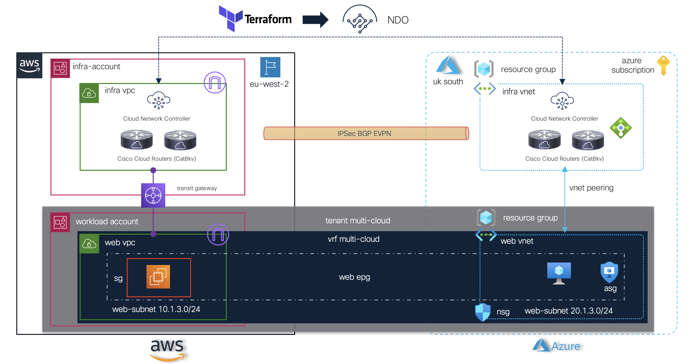

[](https://developer.cisco.com/codeexchange/github/repo/marinalf/ndo-demo-terraform)

## Sample <a href="https://www.terraform.io" target="_blank"> terraform </a> code with <a href="https://www.cisco.com/c/en/us/solutions/data-center-virtualization/application-centric-infrastructure/cloud-network-controller.html" target="_blank"> Cloud Network Controller </a> and <a href="https://www.cisco.com/c/en/us/products/cloud-systems-management/multi-site-orchestrator/index.html" target="_blank"> Orchestrator</a>

This project shows how Nexus Dashboard Orchestrator (NDO) provides consistent network and policy orchestration across AWS and Azure, how Cloud Network Controller normalizes and translates a cloud-like policy model into public cloud native constructs, and how Terraform can be leveraged to automate these operations through the former <a href="https://registry.terraform.io/providers/CiscoDevNet/mso/latest" target="_blank"> mso </a> provider.

**High Level Diagram**



**Use Case: Consistent Policy across Multicloud**

This code builds a VPC in AWS and a VNet in Azure with dedicated subnets to host a Web application (Web EPG in Cloud Network Controller translates to SG and ASG/NSG respectively). Internet access is also enabled using a contract/filter which translates into proper security rules. Web services can then be deployed either in AWS or Azure, or moved between clouds. 

**Pre-requisites**

1) Cloud Network Controller running in AWS and Azure managed by NDO. 
2) Cloud connectivity between AWS and Azure pre-provisioned and automated by NDO with IPSec and BGP EVPN.

**Software**

| Name      | Version |
| --------- | ------- |
| <a href="https://registry.terraform.io/providers/CiscoDevNet/mso/latest" target="_blank"> Terraform Provider</a> |  >= 0.8.1   |
<a href="https://www.cisco.com/c/en/us/products/cloud-systems-management/multi-site-orchestrator/index.html" target="_blank"> NDO </a> | 2.3.x/4.1.x

**Installation**

1. Install and set up your <a href="https://www.terraform.io/downloads.html" target="_blank"> terraform </a> environment
2. Clone/copy the .tf files (main.tf, variables.tf, data_sources.tf, deployer.tf and provider.tf) onto your terraform runtime environment
3. Create an override.tf file with your NDO, AWS, and Azure credentials
4. If using workspaces or remote backend, the provider.tf needs to be modified accordingly. 

**Usage**

```
terraform init
terraform plan
terraform apply
```

**Remarks**

This code demonstrates the use of standard terraform modules with a single schema definition and one template stretched across both clouds. The intent is to show a simple scenario to build upon for multiple schema/templates which can be enhanced with more advanced modules on a per use case basis. 